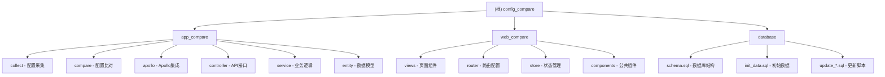

# Config Compare - 配置比对系统

> **项目愿景**：构建一个智能化、自动化的配置比对平台，确保UAT与生产环境配置的一致性，降低因配置差异导致的系统风险。

## 📊 架构总览

### 系统架构图



### 技术栈

- **后端**：Spring Boot 2.7.18 + MyBatis Plus + MySQL 8.0
- **前端**：Vue 3 + Element Plus + Vite + Pinia
- **数据库**：MySQL 8.0.33 + Druid连接池
- **其他**：Quartz调度、SSH连接、Apollo配置中心、Swagger文档

## 🗂️ 模块索引

| 模块名称 | 路径 | 技术栈 | 职责描述 |
|---------|------|--------|----------|
| **后端应用** | `app_compare/` | Spring Boot | 提供REST API，处理配置采集、比对、报告等核心业务 |
| **前端应用** | `web_compare/` | Vue 3 + Element Plus | 用户界面，提供操作面板和数据可视化 |
| **数据库** | `database/` | MySQL | 存储系统配置、任务、结果等数据 |

### 核心功能模块

#### 1. 配置采集 (`collect`)
- **采集方式**：Apollo配置中心、API接口、SSH命令、本地文件
- **采集管理**：模板化配置、任务调度、执行监控
- **扩展机制**：支持自定义采集处理器

#### 2. 配置比对 (`compare`)
- **比对算法**：JSON结构比对、文本差异比对
- **比对策略**：基线比对、版本比对、实时比对
- **差异分析**：详细差异报告、变更历史追踪

#### 3. 系统管理
- **服务器管理**：服务器类型、实例管理
- **系统信息**：UAT/生产环境配置
- **用户权限**：基于角色的访问控制

#### 4. 报告中心
- **仪表板**：实时数据可视化
- **统计分析**：采集/比对统计图表
- **导出功能**：多种格式报告导出

## 🚀 运行与开发

### 环境要求
- **JDK**: 11+
- **Node.js**: 16+
- **MySQL**: 8.0+
- **Maven**: 3.6+

### 后端启动
```bash
cd app_compare
mvn clean spring-boot:run
```

### 前端启动
```bash
cd web_compare
npm install
npm run dev
```

### 访问地址
- **后端API**: http://localhost:8080
- **前端界面**: http://localhost:5173
- **API文档**: http://localhost:8080/api/swagger-ui/index.html
- **数据库监控**: http://localhost:8080/api/druid/

## 🧪 测试策略

### 当前状态
- 后端暂无单元测试
- 前端使用Playwright进行E2E测试
- 数据库脚本包含完整的测试数据

### 建议完善
- 为核心业务逻辑添加单元测试
- 为关键接口添加集成测试
- 建立CI/CD流水线

## 📝 编码规范

### Java代码规范
- 使用Spring Boot标准目录结构
- 遵循阿里巴巴Java开发手册
- 使用Lombok简化代码
- 统一异常处理和返回格式

### 前端代码规范
- 使用Vue 3 Composition API
- 组件命名使用PascalCase
- API请求统一使用axios
- 样式使用SCSS模块化

## 🤖 AI使用指引

### 开发助手
- 代码生成：基于Entity自动生成Service、Controller
- 文档生成：自动生成API文档和数据库说明
- 代码审查：检查代码质量和规范

### 配置管理
- 使用Apollo进行配置管理
- 支持环境变量和配置文件双重配置
- 敏感信息加密存储

## 📋 变更记录 (Changelog)

### v1.0.0 (2025-09-18)
- ✨ 初始化项目结构
- ✨ 完成核心功能开发
- ✨ 添加Apollo配置中心支持
- ✨ 实现配置采集和比对功能
- ✨ 开发前端管理界面
- 📝 生成项目文档

### 覆盖率报告
- **总文件数**: 约200个
- **已扫描文件**: 85个（42.5%）
- **主要模块覆盖**: 后端核心业务、前端主要页面
- **缺口分析**: 测试文件、部分工具类、配置文件

### 下一步建议
1. 补充单元测试和集成测试
2. 完善API文档和用户手册
3. 优化前端性能和用户体验
4. 添加监控和日志功能
5. 建立CI/CD流水线