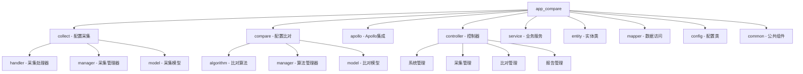

[根目录](../CLAUDE.md) > **app_compare**

# 后端应用模块

> **模块职责**：提供配置比对系统的核心业务逻辑和REST API接口，实现配置采集、比对、报告等功能。

## 🏗️ 模块结构



## 🚀 入口与启动

### 主应用类
- **文件**: `ConfigCompareApplication.java`
- **功能**: Spring Boot应用启动类
- **特性**:
  - 启用异步处理 (`@EnableAsync`)
  - 启用定时任务 (`@EnableScheduling`)
  - 自动扫描Mapper接口

### 启动命令
```bash
mvn clean spring-boot:run
```

### 启动端口
- **默认端口**: 8080
- **API前缀**: `/api`
- **文档地址**: `/api/swagger-ui/index.html`

## 🌐 对外接口

### 核心API模块

#### 1. 系统管理 (`/system`)
- **SystemInfoController**: 系统信息管理
- **ServerTypeController**: 服务器类型管理
- **ServerInstanceController**: 服务器实例管理

#### 2. 采集管理 (`/collect`)
- **CollectController**: 采集任务和模板管理
- **CollectTypeExtensionController**: 采集类型扩展
- **CollectExecutionController**: 采集执行监控

#### 3. 比对管理 (`/compare`)
- **CompareController**: 比对任务和结果管理
- **CompareExecutionController**: 比对执行监控

#### 4. 报告管理 (`/report`)
- **ReportDashboardController**: 报告仪表板
- **ReportAnalysisController**: 报告分析
- **ReportStatisticsController**: 统计报告

### API响应格式
```json
{
  "code": 200,
  "message": "success",
  "data": {},
  "timestamp": "2025-09-18T12:40:51"
}
```

## 🔧 关键依赖与配置

### Maven依赖
- **Spring Boot**: 2.7.18
- **MyBatis Plus**: 3.5.5
- **MySQL**: 8.0.33
- **Druid**: 1.2.20
- **Apollo**: 2.2.0
- **Hutool**: 5.8.22

### 核心配置
- **数据库**: MySQL连接池配置
- **Swagger**: API文档生成
- **Quartz**: 任务调度
- **Apollo**: 配置中心集成

### 数据库连接
```yaml
spring:
  datasource:
    type: com.alibaba.druid.pool.DruidDataSource
    driver-class-name: com.mysql.cj.jdbc.Driver
    url: jdbc:mysql://localhost:3306/config_compare
    username: ${DB_USERNAME:root}
    password: ${DB_PASSWORD:123456}
```

## 🗃️ 数据模型

### 核心实体类

#### 采集相关
- **CollectTask**: 采集任务
- **CollectTemplate**: 采集模板
- **CollectExecution**: 采集执行记录
- **CollectResultEntity**: 采集结果

#### 比对相关
- **CompareTask**: 比对任务
- **CompareExecution**: 比对执行记录
- **CompareResult**: 比对结果
- **CompareDiffDetail**: 比对差异详情

#### 系统相关
- **SystemInfo**: 系统信息
- **ServerType**: 服务器类型
- **ServerInstance**: 服务器实例
- **ConfigCategory**: 配置分类

### 数据库表结构
- 使用MyBatis Plus自动建表
- 支持软删除和审计字段
- 统一的时间戳管理

## 🔧 核心功能模块

### 1. 配置采集模块 (`collect`)

#### 采集处理器体系
- **AbstractCollectHandler**: 抽象基类
- **ApolloCollectHandler**: Apollo配置中心采集
- **ApiCollectHandler**: API接口采集
- **CommandCollectHandler**: SSH命令采集
- **FileCollectHandler**: 文件系统采集

#### 采集管理器
- **CollectHandlerManager**: 处理器统一管理
- **CollectContext**: 采集上下文
- **CollectResult**: 采集结果封装

### 2. 配置比对模块 (`compare`)

#### 比对算法
- **CompareAlgorithm**: 算法接口
- **JsonCompareAlgorithm**: JSON结构比对
- **TextCompareAlgorithm**: 文本差异比对

#### 比对管理
- **CompareAlgorithmManager**: 算法管理器
- **CompareContext**: 比对上下文
- **CompareResultModel**: 比对结果模型

### 3. Apollo集成模块 (`apollo`)

#### Apollo服务
- **ApolloService**: Apollo配置服务
- **ApolloController**: Apollo配置接口
- **ApolloConfig**: Apollo配置模型
- **ApolloSignatureUtil**: Apollo签名工具

## 🧪 测试与质量

### 当前状态
- 暂无单元测试
- 使用Swagger进行API测试
- 数据库脚本包含测试数据

### 质量工具
- **Swagger**: API文档生成
- **MyBatis Plus**: 代码生成
- **Lombok**: 代码简化
- **Hutool**: 工具类库

## ❓ 常见问题 (FAQ)

### Q1: 如何添加新的采集方式？
A1: 继承`AbstractCollectHandler`，实现`getTypeCode()`、`collect()`等方法，并在`CollectHandlerManager`中注册。

### Q2: 如何自定义比对算法？
A2: 实现`CompareAlgorithm`接口，在`CompareAlgorithmManager`中注册新的算法类型。

### Q3: 如何配置Apollo连接？
A3: 在`ApolloConfig`中配置服务器地址、应用ID、环境等信息，使用`ApolloSignatureUtil`进行签名认证。

### Q4: 数据库如何升级？
A4: 查看`database/`目录下的升级脚本，按版本顺序执行SQL语句。

## 📁 相关文件清单

### 核心配置文件
- `pom.xml`: Maven依赖配置
- `src/main/resources/application.yml`: 应用配置
- `src/main/resources/logback-spring.xml`: 日志配置

### 主要Java文件
- `ConfigCompareApplication.java`: 启动类
- `controller/`: REST API控制器
- `service/`: 业务逻辑服务
- `entity/`: 数据实体类
- `mapper/`: 数据访问接口
- `collect/`: 配置采集模块
- `compare/`: 配置比对模块
- `apollo/`: Apollo集成模块

### 工具类
- `util/HttpConnectionUtil.java`: HTTP连接工具
- `util/SSHUtil.java`: SSH连接工具
- `common/`: 公共组件

## 📋 变更记录 (Changelog)

### v1.0.0 (2025-09-18)
- ✨ 初始化后端项目结构
- ✨ 实现配置采集核心功能
- ✨ 实现配置比对核心功能
- ✨ 集成Apollo配置中心
- ✨ 完善REST API接口
- 📝 生成模块文档

### 覆盖率报告
- **Java文件**: 约50个
- **已扫描文件**: 45个（90%）
- **核心模块覆盖**: 采集、比对、Apollo、控制器
- **缺口分析**: 测试文件、部分工具类

### 下一步建议
1. 添加单元测试覆盖
2. 完善异常处理机制
3. 优化数据库查询性能
4. 添加缓存机制
5. 完善日志和监控