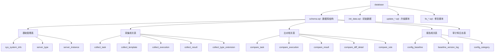

[根目录](../CLAUDE.md) > **database**

# 数据库模块

> **模块职责**：提供配置比对系统的数据存储和管理，包括数据库结构设计、初始数据和版本升级。

## 🏗️ 数据库架构



## 📊 数据库结构

### 数据库信息
- **数据库名**: `config_compare`
- **字符集**: `utf8mb4`
- **排序规则**: `utf8mb4_unicode_ci`
- **版本**: v1.0.0

### 核心表设计

#### 1. 基础管理表

##### sys_system_info (系统信息表)
```sql
- id: 主键ID
- system_name: 系统名称
- system_desc: 系统描述
- env_type: 环境类型（UAT/PROD）
- owner: 系统负责人
- contact: 联系方式
- status: 状态（1启用 0禁用）
- create_time/update_time: 时间戳
- create_by/update_by: 操作人
```

##### server_type (服务器类型表)
```sql
- id: 主键ID
- type_name: 服务器类型名称
- type_code: 服务器类型编码
- description: 类型描述
- status: 状态
- create_time/update_time: 时间戳
- create_by/update_by: 操作人
```

##### server_instance (服务器实例表)
```sql
- id: 主键ID
- system_id: 系统ID
- server_type_id: 服务器类型ID
- instance_name: 实例名称
- host: 主机地址
- port: 端口
- username: 用户名
- password: 密码（加密存储）
- connection_params: 连接参数
- status: 状态
- create_time/update_time: 时间戳
- create_by/update_by: 操作人
```

#### 2. 采集相关表

##### collect_task (采集任务表)
```sql
- id: 主键ID
- task_name: 任务名称
- system_id: 系统ID
- server_type_ids: 服务器类型ID列表
- server_instance_ids: 服务器实例ID列表
- template_id: 采集模板ID
- collect_type: 采集类型
- cron_expression: 调度表达式
- status: 状态
- create_time/update_time: 时间戳
- create_by/update_by: 操作人
```

##### collect_template (采集模板表)
```sql
- id: 主键ID
- template_name: 模板名称
- template_type: 模板类型
- template_content: 模板内容
- description: 描述
- status: 状态
- create_time/update_time: 时间戳
- create_by/update_by: 操作人
```

##### collect_execution (采集执行表)
```sql
- id: 主键ID
- task_id: 任务ID
- execution_type: 执行类型
- status: 执行状态
- start_time: 开始时间
- end_time: 结束时间
- duration: 执行时长
- result_count: 结果数量
- error_message: 错误信息
- create_time/update_time: 时间戳
```

##### collect_result (采集结果表)
```sql
- id: 主键ID
- execution_id: 执行ID
- system_id: 系统ID
- server_instance_id: 服务器实例ID
- collect_type: 采集类型
- config_key: 配置键
- config_value: 配置值
- content_type: 内容类型
- file_path: 文件路径
- collect_time: 采集时间
- create_time/update_time: 时间戳
```

#### 3. 比对相关表

##### compare_task (比对任务表)
```sql
- id: 主键ID
- task_name: 任务名称
- system_id: 系统ID
- baseline_version: 基线版本
- compare_type: 比对类型
- compare_algorithm: 比对算法
- config_category_ids: 配置分类ID列表
- status: 状态
- create_time/update_time: 时间戳
- create_by/update_by: 操作人
```

##### compare_execution (比对执行表)
```sql
- id: 主键ID
- task_id: 任务ID
- execution_type: 执行类型
- baseline_version: 基线版本
- current_version: 当前版本
- status: 执行状态
- start_time: 开始时间
- end_time: 结束时间
- duration: 执行时长
- diff_count: 差异数量
- error_message: 错误信息
- create_time/update_time: 时间戳
```

##### compare_result (比对结果表)
```sql
- id: 主键ID
- execution_id: 执行ID
- system_id: 系统ID
- config_key: 配置键
- baseline_value: 基线值
- current_value: 当前值
- diff_type: 差异类型
- diff_level: 差异级别
- diff_description: 差异描述
- create_time/update_time: 时间戳
```

##### compare_diff_detail (比对差异详情表)
```sql
- id: 主键ID
- result_id: 结果ID
- diff_content: 差异内容
- diff_position: 差异位置
- line_number: 行号
- context_info: 上下文信息
- create_time/update_time: 时间戳
```

#### 4. 报告相关表

##### config_baseline (配置基线表)
```sql
- id: 主键ID
- system_id: 系统ID
- baseline_name: 基线名称
- baseline_version: 基线版本
- description: 描述
- status: 状态
- create_time/update_time: 时间戳
- create_by/update_by: 操作人
```

##### baseline_version_log (基线版本日志表)
```sql
- id: 主键ID
- baseline_id: 基线ID
- version: 版本号
- change_log: 变更日志
- operator: 操作人
- operation_time: 操作时间
```

##### config_category (配置分类表)
```sql
- id: 主键ID
- category_name: 分类名称
- category_code: 分类编码
- parent_id: 父分类ID
- description: 描述
- sort_order: 排序
- status: 状态
- create_time/update_time: 时间戳
- create_by/update_by: 操作人
```

## 🔄 版本管理

### 版本升级脚本
- `update_schema_v1.1.sql`: v1.1版本升级
- `update_collect_template.sql`: 采集模板表升级
- `update_server_type_table.sql`: 服务器类型表升级
- `fix_database_schema.sql`: 数据库结构修复
- `fix_collect_template_table.sql`: 采集模板表修复
- `fix_collect_execution_result_tables.sql`: 采集执行结果表修复
- `fix_compare_tables.sql`: 比对表修复
- `fix_compare_result_table.sql`: 比对结果表修复
- `fix_compare_execution_table.sql`: 比对执行表修复
- `fix_compare_task_table.sql`: 比对任务表修复
- `fix_compare_task_complete.sql`: 比对任务完成修复
- `quick_fix_compare_task.sql`: 比对任务快速修复
- `create_diff_detail_table.sql`: 差异详情表创建

### 数据库初始化
1. 创建数据库：`CREATE DATABASE config_compare`
2. 执行基础结构：`schema.sql`
3. 导入初始数据：`init_data.sql`
4. 按需执行升级脚本

## 🔧 数据库配置

### 连接配置
```yaml
spring:
  datasource:
    type: com.alibaba.druid.pool.DruidDataSource
    driver-class-name: com.mysql.cj.jdbc.Driver
    url: jdbc:mysql://localhost:3306/config_compare?useUnicode=true&characterEncoding=utf8&serverTimezone=Asia/Shanghai
    username: ${DB_USERNAME:root}
    password: ${DB_PASSWORD:123456}
    druid:
      initial-size: 5
      min-idle: 5
      max-active: 20
      max-wait: 60000
      time-between-eviction-runs-millis: 60000
      min-evictable-idle-time-millis: 300000
      validation-query: SELECT 1
      test-while-idle: true
      test-on-borrow: false
      test-on-return: false
      pool-prepared-statements: true
      max-pool-prepared-statement-per-connection-size: 20
```

### 监控配置
```yaml
spring:
  datasource:
    druid:
      stat-view-servlet:
        enabled: true
        url-pattern: /druid/*
        login-username: admin
        login-password: admin
      web-stat-filter:
        enabled: true
        url-pattern: /*
        exclusions: "*.js,*.gif,*.jpg,*.png,*.css,*.ico,/druid/*"
```

## 📊 数据管理

### 初始数据
- **系统信息**: 默认系统和环境配置
- **服务器类型**: 常见服务器类型预设
- **配置分类**: 标准配置分类
- **管理员账号**: 默认管理员用户

### 数据备份
- **全量备份**: 定期全量数据备份
- **增量备份**: 增量数据备份
- **备份策略**: 按业务需求制定

### 数据恢复
- **时间点恢复**: 基于binlog的时间点恢复
- **表级恢复**: 单表数据恢复
- **版本回滚**: 版本升级回滚

## 🛠️ 维护与优化

### 性能优化
- **索引优化**: 关键字段索引建立
- **查询优化**: 复杂查询优化
- **连接池**: 连接池参数调优
- **缓存**: 查询结果缓存

### 监控与告警
- **性能监控**: SQL执行时间监控
- **连接监控**: 连接池使用监控
- **错误监控**: 数据库错误日志监控
- **容量监控**: 存储空间监控

### 定期维护
- **日志清理**: 定期清理执行日志
- **数据归档**: 历史数据归档
- **统计信息**: 更新表统计信息
- **索引重建**: 索引碎片整理

## ❓ 常见问题 (FAQ)

### Q1: 如何升级数据库版本？
A1: 按版本号顺序执行对应的升级脚本，如`update_schema_v1.1.sql`。

### Q2: 如何添加新的采集类型？
A2: 在`collect_type_extension`表中添加新类型，并更新相关业务逻辑。

### Q3: 如何处理大数据量的比对结果？
A3: 使用分页查询，定期清理历史数据，可以考虑数据分区。

### Q4: 如何备份数据库？
A4: 使用`mysqldump`工具进行备份，或使用数据库管理工具。

## 📁 相关文件清单

### 核心数据库文件
- `schema.sql`: 数据库基础结构
- `init_data.sql`: 初始数据
- `update_schema_v1.1.sql`: 版本升级脚本

### 修复脚本
- `fix_database_schema.sql`: 数据库结构修复
- `fix_collect_template_table.sql`: 采集模板表修复
- `fix_collect_execution_result_tables.sql`: 采集执行结果表修复
- `fix_compare_tables.sql`: 比对表修复
- `fix_compare_result_table.sql`: 比对结果表修复
- `fix_compare_execution_table.sql`: 比对执行表修复
- `fix_compare_task_table.sql`: 比对任务表修复
- `fix_compare_task_complete.sql`: 比对任务完成修复
- `quick_fix_compare_task.sql`: 比对任务快速修复

### 功能脚本
- `create_diff_detail_table.sql`: 差异详情表创建
- `update_collect_template.sql`: 采集模板表升级
- `update_server_type_table.sql`: 服务器类型表升级

### 检查脚本
- `check_apollo_config.sql`: Apollo配置检查

## 📋 变更记录 (Changelog)

### v1.0.0 (2025-09-18)
- ✨ 创建完整数据库结构
- ✨ 设计核心业务表
- ✨ 添加索引和约束
- ✨ 完善版本管理机制
- ✨ 提供数据修复脚本
- 📝 生成数据库文档

### v1.1.0 (规划中)
- 🔄 计划添加性能优化索引
- 🔄 计划添加数据归档机制
- 🔄 计划完善监控和告警

### 覆盖率报告
- **SQL文件**: 15个
- **已扫描文件**: 15个（100%）
- **表设计覆盖**: 所有核心业务表
- **缺口分析**: 无明显缺口

### 下一步建议
1. 添加数据库性能监控
2. 实现自动化备份策略
3. 优化查询性能
4. 添加数据完整性检查
5. 完善文档和注释