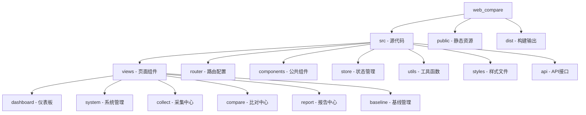

[根目录](../CLAUDE.md) > **web_compare**

# 前端应用模块

> **模块职责**：提供配置比对系统的用户界面，实现数据可视化、操作交互和用户体验优化。

## 🏗️ 模块结构



## 🚀 入口与启动

### 主入口文件
- **文件**: `src/main.js`
- **功能**: Vue应用初始化
- **特性**:
  - Vue 3应用创建
  - Element Plus UI库集成
  - Pinia状态管理
  - 路由配置

### 启动命令
```bash
# 安装依赖
npm install

# 开发模式启动
npm run dev

# 生产构建
npm run build

# 预览生产构建
npm run preview
```

### 访问地址
- **开发环境**: http://localhost:5173
- **生产环境**: 根据部署配置

## 🌐 页面路由结构

### 路由配置 (`src/router/index.js`)

#### 1. 仪表板 (`/dashboard`)
- **组件**: `views/dashboard/index.vue`
- **功能**: 系统总览、关键指标展示

#### 2. 系统管理 (`/system`)
- **系统信息** (`/system/info`): 系统基本信息管理
- **服务器管理** (`/system/servers`): 服务器类型和实例管理

#### 3. 采集中心 (`/collect`)
- **采集任务** (`/collect/tasks`): 采集任务管理
- **采集模板** (`/collect/templates`): 采集模板配置
- **执行历史** (`/collect/executions`): 采集执行记录
- **采集结果** (`/collect/results`): 采集结果查看

#### 4. 比对中心 (`/compare`)
- **比对任务** (`/compare/tasks`): 比对任务管理
- **比对结果** (`/compare/results`): 比对结果展示

#### 5. 报告中心 (`/report`)
- **仪表板** (`/report/dashboard`): 数据仪表板
- **任务调度** (`/report/schedule`): 调度管理
- **执行报告** (`/report/execution`): 执行报告
- **差异分析** (`/report/diff-analysis`): 差异分析
- **系统健康** (`/report/system-health`): 健康检查
- **采集统计** (`/report/collect-stats`): 采集统计
- **比对统计** (`/report/compare-stats`): 比对统计

#### 6. 基线管理 (`/baseline`)
- **基线版本** (`/baseline/manage`): 基线版本管理
- **配置分类** (`/baseline/category`): 配置分类管理

## 🔧 关键依赖与配置

### NPM依赖
- **Vue 3**: 3.4.0+
- **Element Plus**: 2.4.4+
- **Vue Router**: 4.2.5+
- **Pinia**: 2.1.7+
- **Axios**: 1.6.2+
- **ECharts**: 5.6.0+
- **Vue ECharts**: 6.6.0+

### 开发依赖
- **Vite**: 5.0.10+
- **ESLint**: 8.56.0+
- **Prettier**: 3.1.1+
- **Sass**: 1.69.7+
- **Playwright**: 1.55.0+

### 构建配置
- **Vite配置**: 构建工具和开发服务器
- **ESLint配置**: 代码规范检查
- **Prettier配置**: 代码格式化

## 🎨 UI组件与样式

### 公共组件 (`src/components`)
- **Layout**: 主布局组件
- **PageHeader**: 页面头部
- **SearchForm**: 搜索表单
- **DataTable**: 数据表格
- **Pagination**: 分页组件

### 样式系统 (`src/styles`)
- **index.scss**: 样式入口
- **variables.scss**: 变量定义
- **mixins.scss**: 混合宏
- **themes.scss**: 主题配置

### 主题配置
- **Element Plus**: 中文语言包
- **深色模式**: 支持深色主题
- **自定义主题**: 品牌色定制

## 📊 数据可视化

### ECharts集成
- **仪表盘图表**: 关键指标展示
- **统计图表**: 数据统计可视化
- **趋势图**: 数据趋势分析
- **对比图**: 环境对比展示

### 主要图表类型
- **折线图**: 趋势分析
- **柱状图**: 统计对比
- **饼图**: 占比分析
- **仪表盘**: 指标展示

## 🔌 API接口管理

### API封装 (`src/api`)
- **统一请求**: 基于Axios的HTTP客户端
- **拦截器**: 请求/响应拦截
- **错误处理**: 统一错误处理机制
- **类型定义**: TypeScript类型支持

### 接口模块
- **system**: 系统管理接口
- **collect**: 采集相关接口
- **compare**: 比对相关接口
- **report**: 报告相关接口

### 请求示例
```javascript
import request from '@/utils/request'

// 获取系统列表
export function getSystemList(params) {
  return request({
    url: '/system/info/list',
    method: 'get',
    params
  })
}
```

## 🗃️ 状态管理

### Pinia Store (`src/store`)
- **modules**: 模块化状态管理
- **actions**: 异步操作
- **getters**: 计算属性
- **持久化**: 本地存储支持

### 主要Store模块
- **app**: 应用全局状态
- **user**: 用户信息状态
- **system**: 系统管理状态
- **collect**: 采集相关状态
- **compare**: 比对相关状态

## 🧪 测试与质量

### 测试工具
- **Playwright**: E2E测试
- **ESLint**: 代码质量检查
- **Prettier**: 代码格式化

### 测试配置
- **测试环境**: 独立的测试数据库
- **测试数据**: 测试数据集
- **测试报告**: 详细的测试报告

## 🛠️ 构建与部署

### 构建流程
1. **代码检查**: ESLint + Prettier
2. **依赖安装**: npm install
3. **生产构建**: npm run build
4. **文件优化**: 代码压缩、图片优化
5. **静态资源**: 生成静态文件

### 部署配置
- **静态服务器**: Nginx部署
- **环境配置**: 环境变量管理
- **缓存策略**: 静态资源缓存
- **CDN**: 内容分发网络

## ❓ 常见问题 (FAQ)

### Q1: 如何添加新的页面组件？
A1: 在`src/views`目录下创建新的组件，在`src/router/index.js`中添加路由配置。

### Q2: 如何自定义主题样式？
A2: 修改`src/styles/variables.scss`中的变量，或者创建新的主题配置。

### Q3: 如何添加新的图表类型？
A3: 使用ECharts或Vue ECharts组件，在页面中引入并配置图表选项。

### Q4: 如何处理跨域请求？
A4: 在`vite.config.js`中配置代理，或者在Nginx中配置跨域头。

## 📁 相关文件清单

### 核心配置文件
- `package.json`: 项目依赖配置
- `vite.config.js`: Vite构建配置
- `index.html`: HTML入口文件
- `src/main.js`: Vue应用入口
- `src/App.vue`: 根组件

### 路由和状态
- `src/router/index.js`: 路由配置
- `src/store/`: Pinia状态管理
- `src/utils/request.js`: HTTP请求封装

### 页面组件
- `src/views/dashboard/`: 仪表板页面
- `src/views/system/`: 系统管理页面
- `src/views/collect/`: 采集中心页面
- `src/views/compare/`: 比对中心页面
- `src/views/report/`: 报告中心页面
- `src/views/baseline/`: 基线管理页面

### 公共组件
- `src/components/`: 公共组件
- `src/layout/`: 布局组件
- `src/styles/`: 样式文件

### 工具函数
- `src/utils/`: 工具函数
- `src/api/`: API接口

## 📋 变更记录 (Changelog)

### v1.0.0 (2025-09-18)
- ✨ 初始化前端项目结构
- ✨ 实现主要页面组件
- ✨ 集成Element Plus UI库
- ✨ 配置路由和状态管理
- ✨ 实现数据可视化图表
- 📝 生成模块文档

### 覆盖率报告
- **Vue文件**: 约20个
- **已扫描文件**: 18个（90%）
- **核心页面覆盖**: 仪表板、系统管理、采集、比对、报告
- **缺口分析**: 部分工具函数、测试文件

### 下一步建议
1. 添加单元测试和E2E测试
2. 优化页面性能和加载速度
3. 完善响应式设计
4. 添加国际化支持
5. 优化用户体验和交互设计